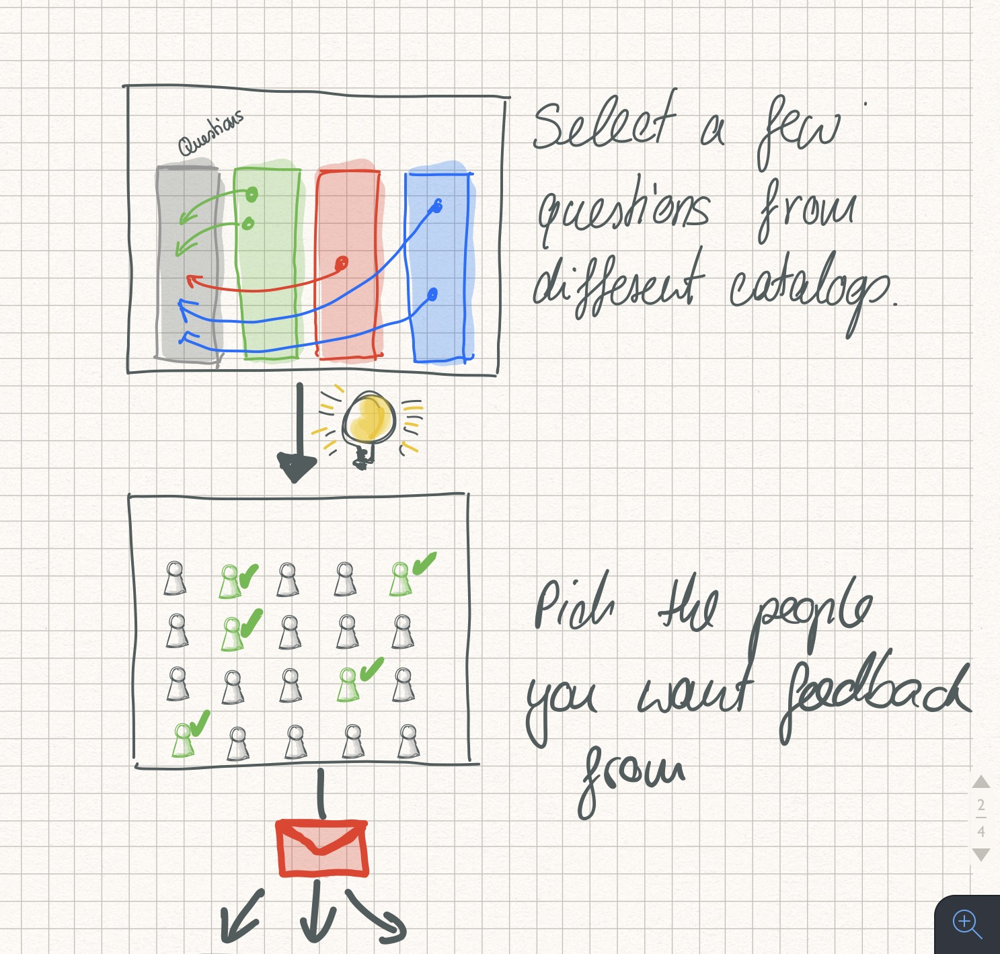
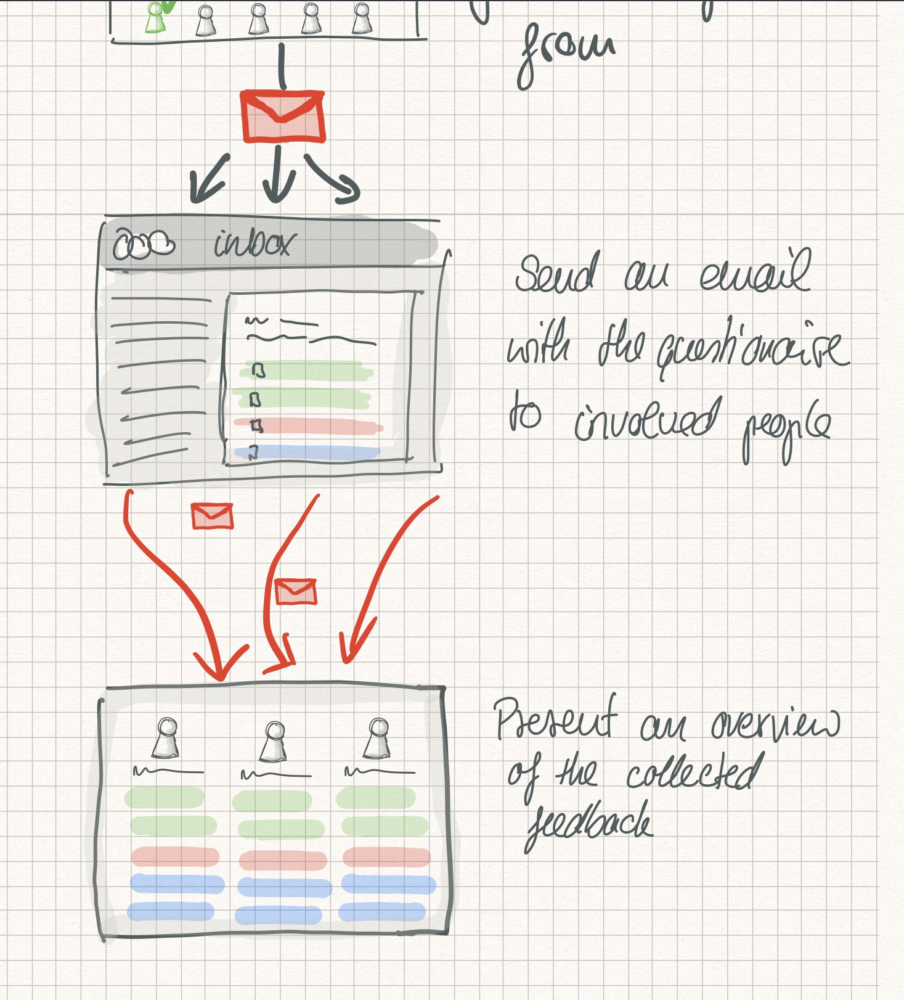

*Update:* I fixed a bunch of typos (😱) and added an update about questions. Keep an eye out for more posts around this idea.

Today was a fairly 'feedback-centric' day for me. I had multiple conversations with different people, all around some notion of _feedback_. In some conversations, I was explicitly asking for feedback on a presentation that was given a few days ago. In others, people were asking me for feedback on where I saw them on their path as engineers and how to progress on it. And finally, in a different conversation we talked about our current feedback process, why we do it, what shortcomings it has, and how we could improve it. All of this made me think about what makes feedback useful and whether or not the way we are collecting it adds or detracts value from that feedback.

## What I want from feedback

The way I see it,  there are a few criteria that feedback needs to fulfil for it to be useful for as a tool for growth:

- It needs to *timely*. The gap between feedback rounds needs to be big enough to allow evolution, but small enough to keep people on track.
- It needs to be *specific*. The given feedback should be precise enough to derive potential adjustments to current behaviours.
- It needs to be *individualised*. At different times, different kinds of feedback will be most valuable. A generic form will more likely invite generic feedback.
- It needs to be *effortless*. The harder and more time consuming it is to give feedback, the less thought will be spent on giving timely, individual, and specific feedback.

With these thoughts in mind, I drafted out a few sketches of what I think an effective feedback tool might look like.

## Asking the right questions

The first two steps are picking the right questions to ask and selecting the right group of people to ask them. This should help with making the feedback _specific and individualised_.

An important part of these steps is to have a conversation about what areas need feedback beforand. Without overwhelming the user with too many options, there should a few broad categories from where to choose questions from. The app should probably limit the number of questions down to 5 - 6 at most, to limit the time needed to provide the feedback. The next step allows the mentor/mentee piar to pick the right people that are in the best position to give feedback and valuabel insights. This again should be limited to a small number to reduce the amount of disruption caused by giving feedback.

## Giving and using feedback

The constructed questionnaire is then sent via email (with a few reminders if needed?) to the selected group. Keeping the visuals minimal, and maybe even making it possible to reply via email will reduce the friction to giving feedback.

Once compelted, the last screen will show the collected feedback from the entire group. This screen will then be used during the feedback round by the mentor to guide the feedback conversation. It might be necessary to anonymize the feedback by not showing who actually sent it.

The above is just the sketch of an idea with a bit of wording. The next steps will be to come up with some very basic HTML to see what pages could look like in real life.

## _Update from 23 June 2019_

Shortly after posting this a colleague and built a prototype. Since I've been tinkering with it and turned into (mostly?) functioning Elixir/Phoenix app. You can find the source for [advisorex here](https://github.com/felipesere/advisorex).

### The value of questions

I think the most interesting aspect of this app/exercise is in the questions. Having recently read  *The Mom Test* by Rob Fitzpatrick ([Amazon link](https://www.amazon.co.uk/Mom-Test-customers-business-everyone/dp/1492180742)) I am ever more intrigued about how questions influence the answers we are looking for and how much the setting and culture matter.

Initially, I wanted to move conotation of the questions away from feedback (_negative, corrective action, requires improvements_) and take it towards *advice* (_positive, ideas, suggestions, examples_) to help people give more useful, genuine feedback. My hypothesis was that no-one wants to stand in the way of someone elses career by surfacing areas where otheres were lacking. I still think this to be true. The preassures during the perforamance review for both sides make it so that it is really hard to extract valuable insights in a meaningful way. 

Robs book *The Mom Test* has given me some tools and ideas on how to look at questions with the goal to learn from _something_ from the answers. I want to give this more thought and do a better write-up of how *The Mom Test* could be woven into a feedback tool.

