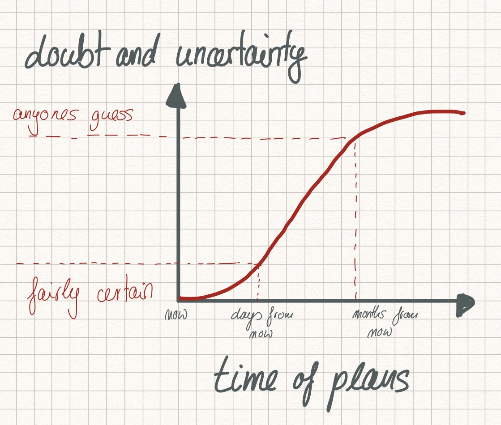
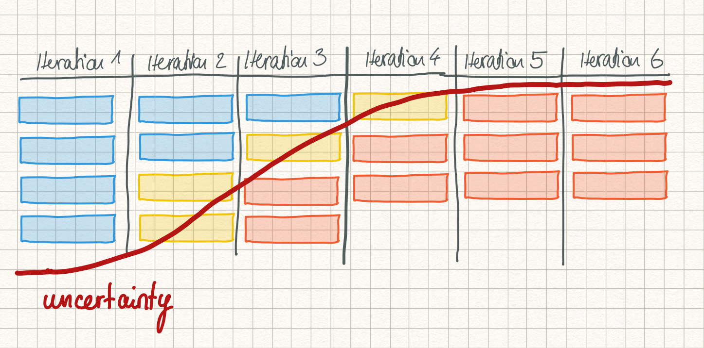
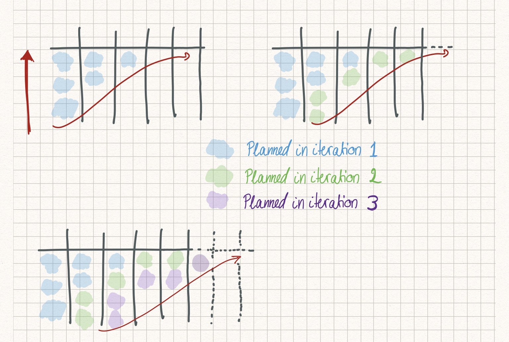

Over the last year, I have attended 3 or 4 Release Train Planning (RTP) meetings. In these meetings, the entire team came together and planned out the next release. A release is roughly a three month period, made up of 6 two-week iterations. The way these meetings are run is that the objective of a given release is introduced by a business representative and teams break down the work into stories which are mapped against the 6 iterations. All the teams taking part in the release then come back together to present their plan, synchronize it with the other teams and commit to results and dates.

The rigidity of this ritual struck me as odd. When the mics were off, people spoke about these plans and the fact that they always change anyway as the deadline approaches. No real surprise there. The odd thing was that everybody went along, put effort into a plan, re-jigged it to line up with another teams plan, and then committed to delivering this fine master-piece of Gantt charts. All in a 3-day effort by about 50 or 60 people.

Somebody somewhere must have left those RTP feeling happy and confident in the plans. But knowing that future plans have an increasing chance of not coming to fruition, that time spent planning could have been spent elsewhere.

Uncertainty is an important factor when planning. Not only is there uncertainty on how to execute a given task, but there is also uncertainty on whether to execute it at all.
What needs to happen before it, or whether it needs to be re-thought. Let's put the uncertainty on a graph against the time we intend to execute on the plans:

Plans made for the next couple of days are fairly certain, while plans for things months from now are pretty much anyone's guess.  Think about the last 5-6 months of your last project: requirements changed, deadlines moved, earlier tasks unearthed a new set of challenges or unexpected opportunities. All of this will put your perfectly drawn Gantt chart out of whack.

Let's return to the RTP, where we planned our next 4-5 months of development, cramming each iteration with stories until they are full. The image below shows a fictional team board, with the necessary stories for the next 6 iterations, overlayed by a red line showing the increasing doubts as plans are further in the future:

The color coding should show how at risk these stories are. From the top left (urgent and critical) in blue to the bottom right (neither urgent nor important) in red. The yellow stories are somewhere in between. An interesting observation is that the top story in iteration 3 is blue, while the third and fourth stories in iteration 2 are yellow. The blue story in iteration 3 is going to be the highest priority in that iteration, while the other two yellow ones are a low priority, meaning they could be dropped or changed. Now keep in mind, we are still planning ahead. We have not completed any of the stories.

The uncertainty lines help us in deciding whether there is value in planning stories underneath it. It helps us focus on the right now of the important tasks, rather than spending precious time planing future stories, let alone future unimportant stories.

So how should we plan? Many, many, many small plans for a near-future horizon. Concentrating the entire planning into three days for 4 months is a recipe for disaster. There is no wiggle-room. No space for learning. No space for adjusting. Too many wheels are in motion and too many interdependencies are in play.

To make the effect of many smaller plannings clearer, let's see how they fare with the uncertainty. The next image shows three simplified views of the board, once before the first, second, and third iteration.

As you can see, the planning horizon was kept short: next iteration and a story or two for the iterations after that. Only the current iteration was packed with stories. All other iterations were left with some space, giving the team some breathing room to react to new information. Important stories or features which the team had to address at some point (important, but not urgent) were put on the board, but their iterations definitely not filled.

It is tempting to go for the _big plan_. To lay out all the cards on the table. To get everybody together, and for once get everybody to agree to a plan _and stick to it_. Sadly, the underlying closed-world assumptions (we know all the facts in advance) rarely holds true. Smaller, more frequent plans give you the necessary freedom to change direction. To adjust and react to new events. I urge you to give it a try. The beauty of trying this idea: if it doesn't work out for you, you have at most lost an iteration or two, instead of an entire release. Isn't that something worth trying?

_**Experts Disclaimer:** If you your first thought after reading this is "We don't do any RTPs at all!" and planning iterations in advance is not something you would recommend, I agree. For some teams, getting from half-yearly or quarterly releases down to fortnightly iterations is already an achievement. This article is intended for readers beginning their journey to a more continuous delivery of value._
