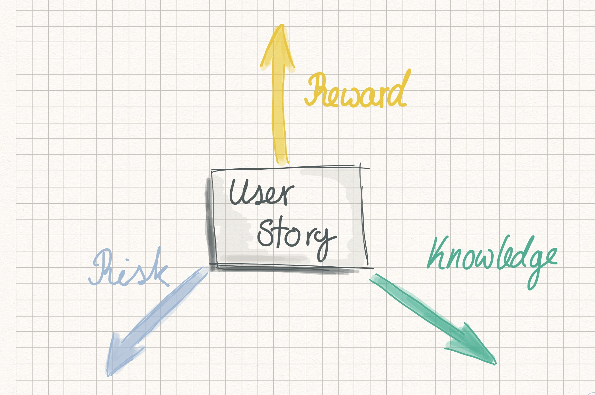

We were recently talking about the backlog of user stories for a project on the near horizon. We wanted to create an exemplary backlog with meaningful stories that would allow the team to succeed. The backlog should also show the less technical side of the organisation that they needn't deliver all functionality in one large push. When the question of which story to tackle first came up, "do the most important thing" didn't feel good enough.

The user story backlog is linear so that the team has an obvious point from where to pull in the next piece of work. Yet there are many aspects that make a story important:

* It has (real or perceived) value to customer, which we will harvest when the story is completed.
* It carries risk to the business, the customer, and the development team itself.
* It unlocks knowledge, which enables and impacts future stories.

With this in mind we can compare the stories along those three axes and come up with different ways of sorting our backlog, which in turn reflect upon our business priorities and project phase.

### Reward driven backlog

Sorting user stories by their real or perceived value is a good initial strategy, if recuperating our costs is a priority. This kind of optimization works for teams that are short on cash and may not even get through the entire backlog. The moment we deliver a story that adds significant benefit to our customers, we become a valued partner. In environments that are driven by reducing costs, delivering some piece of functionality that reduces the costs or increases the value, may result in compounding effects for the bottom line.

For the purpose of comparing user stories, the value of a user story can be roughly approximated. Should no real data be available, a back-of-the-napkin calculation or an educated guess is enough to decide between two stories most of the time.

### Risk driven backlog

More often than not reward is tied to risk. Adding a feature that might benefit 80% of our user base also means that we run the risk of disgruntling 80% of our users. Think of a “Todo” application, where we decide to add a smart sorting algorithm that intelligently rearranges the todos by priority and due date. If it works, every user will get a pretty smart todo list. If we introduce a flaw, we are damaging the core functionality of our app for every user.

So a user story "sorting" strategy is to work on stories which minimize risk by having a low overall impact. Those stories are a safe place to experiment and get to grips with the domain that we are working in. This is a decent strategy for well-established systems that have a steady, loyal customer base. Or systems that are relied upon by other production systems. It also involves a significant time and financial investment as the less risky stories might not be the most rewarding.

### Knowledge driven backlog

All projects will have aspects to them that the team has not encountered before. You may need to connect bespoke systems that were not designed to do so. Or you may need to process something completely different than before. Stories that enable you to go and find (or discard!) potential solutions are not directly tied to customer value. They are valuable to the team and create opportunities to unlock further stories.

If you are treading in uncharted territory prioritising stories that will unlock further stories becomes a winning strategy. Such stories are sometimes called 'spikes', though I prefer the term 'experiments'. Experiments emphasise that we are walking into unknown territory and that an answer might be "we pushed it far, but we couldn't make it work in time". Even cutting corners is OK with an experiment, as long there is a lesson to be learnt.

### A Blend

All three of the above approaches are valid, and as usual the key is in finding the right blend for the current backlog. As the project progresses through different phases, a different aspect of a user story will have more pull. Teams in the early development stages will probably benefit the most from a few knowledge stories to find their way through the technology and domain. As the project begins to take shape, recuperating some of the costs and building trust with stakeholders will likely mean a shift towards reward stories. Finally, as the project reaches maturity, a more careful risk-driven approach might be better suited. Granted that at any moment the focus can shift. Understanding that stories can fall into any (and maybe even many) of the categories gives us a tool to compare and better understand our backlog.

_**Extra**: If you want to read more about different phases of a team/project and how that affects estimates,teams, and money and many others, take a look at [Kent Becks 3X](https://www.facebook.com/notes/kent-beck/comparing-explore-expand-and-extract-topics-in-3x/1241983035834558) and how that is evolving._
