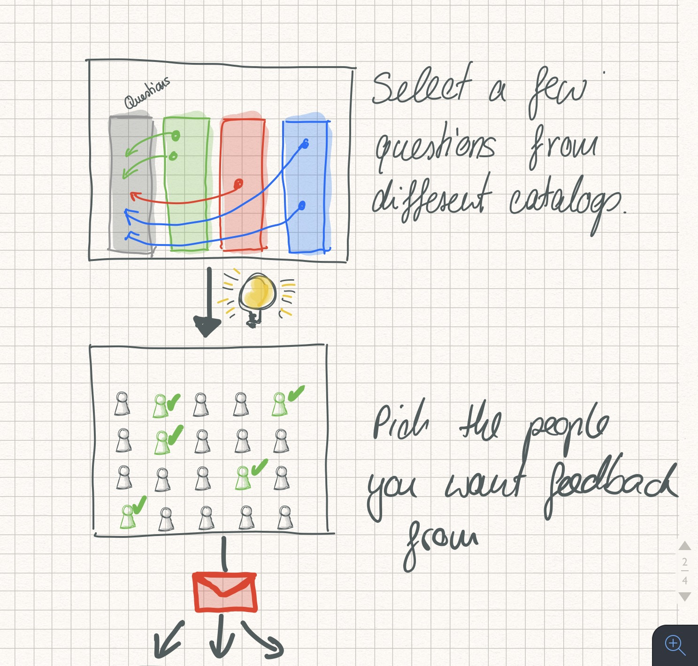
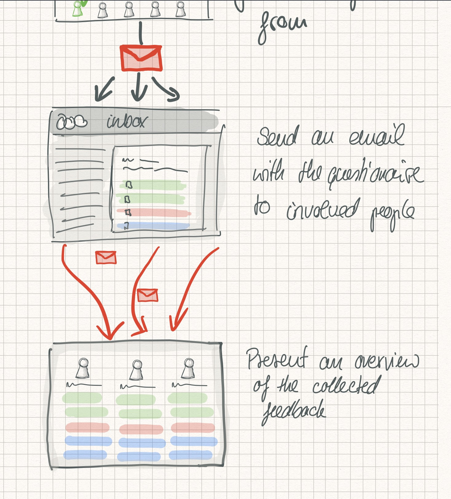

Today was a fairly 'feedback-centric' day for me. I had multiple conversations with different people. In some conversations, I was explicitly asking for feedback on a presentation that was given a few days ago. In others, people were asking me for feedback on where they currently are on their path to mastery and how to progress on it. And finally, in a different conversation we talked about our current feedback process, why we do it, what shortcomings it has and how we could improve it. All of this made me think about what makes feedback useful and whether or not the way we are collecting it adds or detracts value from that feedback.

### What I want from feedback

There is some provision for feedback that I feel need to be met for it to be useful:

- It needs to timely. The gap between feedback rounds needs to be big enough to allow evolution, but small enough to keep people on track.
- It needs to be specific. The given feedback should be precise enough to derive potential adjustments to current behaviours.
- It needs to be individualised. At different times, different kinds of feedback will be most valuable. A generic form will more likely invite generic feedback.
- It needs to be effortless. The harder and more time consuming it is to give feedback, the less thought will be spent on giving timely, individual, and specific feedback.

With these thoughts in mind, I drafted out a few sketches of what I think an effective feedback tool might look like.

### Constructing the right form

The first two steps are picking the right questions to ask the selecting the right group of people to ask. This should help with making the feedback _specific and individualised_.

An important part of these steps is to have a conversation about what areas need feedback. Without overwhelming with too many options, there should a few broad categories from where to choose questions from. The app should probably limit the number of questions down to 5-6 at most, to limit the time needed to provide the feedback. The next step allows the pair to pick the right people that are in the best position to give the feedback. This again should be limited to a small number to reduce the amount of disruption caused by giving feedback.

### Giving and using feedback

The constructed question is then sent via email (with a few reminders if needed?) to the selected group. Keeping the visuals minimal, and maybe even making it possible to reply via email will reduce the friction to giving feedback.

The last screen will show the collected feedback from the entire group. This screen will then be used during the feedback round by the group lead to guide the feedback conversation. It might be necessary to anonymize the feedback by not showing who actually sent it.

The above is just the sketch of an idea with a bit of wording. The next steps will be to come up with some very basic HTML to see what pages could look like in real life.
