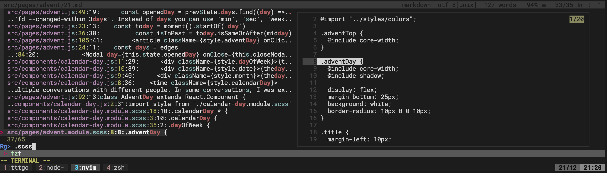

I have hinted at my own `vim` plugins before, and here is my latest addition: [felipesere/search](https://github.com/felipesere/search))

Install it and `fzf` using `vim-plug` like so

```
  Plug 'junegunn/fzf', { 'dir': '~/.fzf', 'do': './install --all' }
  Plug 'felipesere/search'
```

end rejoice!

Here is a quick video of where I search aroud the repository of this repo:
[](https://asciinema.org/a/dQ7xNaQisIzuz1TkjTdMxX9cX)

There are two commands that this plugin provides:

- `:Search a-word` will look for `a-word` throughout the code base
- `:FindUnderCursor` will look for the word that is under the cursor

I have mapped the second one to my leader key and `s` with:

```vim
nmap <silent> <Leader>s :execute 'FindUnderCursor'<CR>
```

What I particularly like is the the preview to the right:



Admittedly, the colors are currently a bit whack but I am sure I can fix that over time 😅
