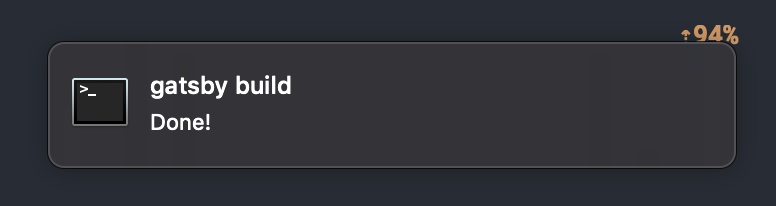

Yesterday I mentioned a tool to rerun tests, today I want to share a tool for those long-running tasks that we launch into the background.

Are you in charge of deployments that sometimes take 5min? Or have to compile a particularly large project? Or downloading a largish file regularly?
Then this one is for you!

[noti](https://github.com/variadico/noti) is a small programm to watch other programms for completion on pop a notiaction onto your desktop.
At its simplest you prefix the comamnd you want to watch with `noti`, like so:

```bash
$ noti ansible-playbook fancy-app.yml --limit staging
```

That will just igive you a notification that the job is done.

If you want a few nicer messages, use `-t` for the title and `-m` for the actual message.
The title option will default to the command, which can become illegible when there are too many arguments.

I particularly liked this tool for long running processes like infrastructure deployments.
...or building this site on my small MacBook, as you can see from below screenshot:



