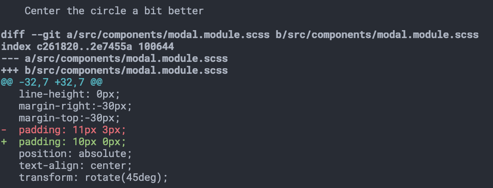
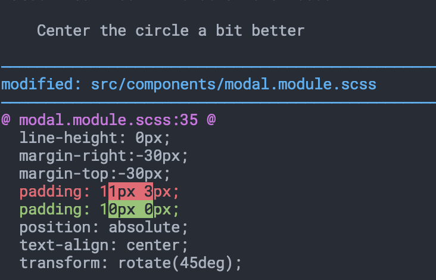

Even though I use different IDEs for different languages (WebStorm and IntelliJ come to mind) I still always commit my code through the command line.
One thing that had annoyed me for a while was that the `diff` output feels a bit
cluttered. Not only cluttered, _unnecessarily_cluttered.

1. The paths can't be quickly copy/pasted as they are prefixed `a/` and `/b`
2. The path of the file shows up 4 (!) times in the screenshot
3. I never use the shown git SHA1s or the octal permissions (_if they are even permissions?_)

But the I am not alone with this.
The friendly folds at [Diff-So-Fancy](https://github.com/so-fancy/diff-so-fancy) built a great _pager_ that you
can hook into `git` to get much tidier diffs.
This is the same diff as above, but with `diff-so-fancy`:

Two immediate improvements: the path information boils down entirely to the atual file path _and_ `diff-so-fancy` highlights 
changes within the line separately.

Diff-So-Fancy helps me zooooom over diffs, as it reduces visual noise and emphasies the things I do want to see much more clearly.

Follow their instructions on the Github page to install and _see the difference_ for yourself!

